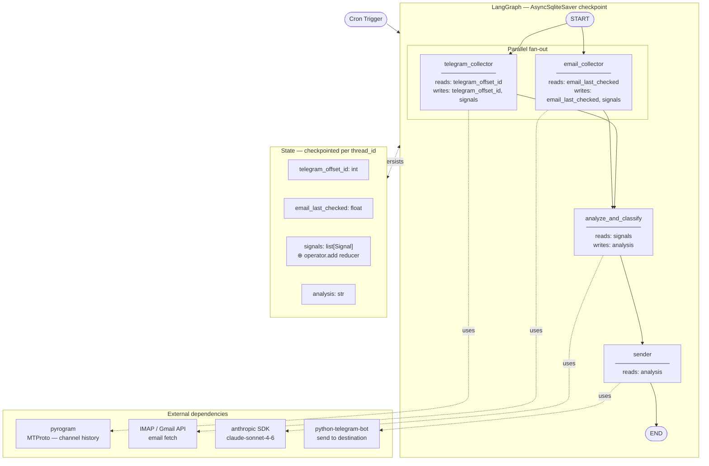

# LangGraph Flow Design: Cron-Driven Multi-Source Signal Collector

**Date:** 2026-05-02
**Status:** Approved

---

## Problem

The original flow diagram proposed:
- An "Agent Router" node to decide which collectors to invoke
- Sequential fan-out to a Telegram collector and Email analyser
- An "Aggregator" node to merge results

This has four misalignments with LangGraph best practices:

2. **No true parallelism** — both collectors can and should run concurrently via native fan-out
3. **"Aggregator" is the wrong abstraction** — LangGraph uses state reducers for merging; the LLM analysis is a separate concern
4. **Telegram offset_id managed ad-hoc** — should live in graph state and be persisted automatically via SqliteSaver

---

## Architecture

### Graph Topology

```
START → telegram_collector ──┐
START → email_collector ─────┴→ analyze_and_classify → sender → END
```

- Fan-in is automatic: `analyze_and_classify` waits for both collectors before executing
- `telegram_offset_id` is stored in state and checkpointed via `AsyncSqliteSaver`

### Architecture Diagram



### State Schema

```python
from typing import Annotated
import operator
from typing_extensions import TypedDict

class Signal(TypedDict):
    title: str
    classification: str   # "urgent" | "informational" | "noise" | "error"
    summary: str
    source: str           # "telegram" | "email"

class State(TypedDict):
    telegram_offset_id: int                          # persisted across cron runs
    email_last_checked: float                        # unix timestamp, persisted across cron runs
    signals: Annotated[list[Signal], operator.add]   # merged from both collectors
    analysis: str                                    # LLM output
```

`Annotated[list[Signal], operator.add]` is the LangGraph fan-in reducer: both collectors write
to `signals` concurrently and the lists are merged without conflict.

### Graph Compilation

```python
from langgraph.graph import StateGraph, START, END
from langgraph.checkpoint.sqlite.aio import AsyncSqliteSaver

builder = StateGraph(State)

builder.add_node("telegram_collector", telegram_collector_node)
builder.add_node("email_collector", email_collector_node)
builder.add_node("analyze_and_classify", analyze_and_classify_node)
builder.add_node("sender", sender_node)

builder.add_edge(START, "telegram_collector")
builder.add_edge(START, "email_collector")
builder.add_edge("telegram_collector", "analyze_and_classify")
builder.add_edge("email_collector", "analyze_and_classify")
builder.add_edge("analyze_and_classify", "sender")
builder.add_edge("sender", END)

async with AsyncSqliteSaver.from_conn_string("checkpoints.db") as checkpointer:
    graph = builder.compile(checkpointer=checkpointer)
```

### Cron Invocation

```python
config = {"configurable": {"thread_id": "main"}}
await graph.ainvoke({}, config=config)
```

The same `thread_id` on every run causes LangGraph to restore the last checkpoint automatically,
including `telegram_offset_id`.

---

## Node Responsibilities

| Node | Type | Library | Reads from state | Writes to state |
|---|---|---|---|---|
| `telegram_collector` | Tool call | `pyrogram` (MTProto) | `telegram_offset_id` | `telegram_offset_id`, `signals` |
| `email_collector` | Tool call | IMAP / Gmail API | `email_last_checked` | `email_last_checked`, `signals` |
| `analyze_and_classify` | LLM node | `anthropic` | `signals` | `analysis` |
| `sender` | Side effect | `python-telegram-bot` | `analysis` | — |

### telegram_collector_node

Uses `pyrogram` (MTProto) — not `python-telegram-bot` (Bot API). The Bot API cannot read
arbitrary channel history; MTProto can. `offset_id` is an integer message ID (confirmed against
Telegram MTProto docs).

```python
async def telegram_collector_node(state: State) -> dict:
    try:
        async with pyrogram_client() as client:
            messages = await client.get_history(
                channel_id=CHANNEL_ID,
                offset_id=state["telegram_offset_id"],
                limit=100
            )
        if not messages:
            return {}
        signals = [classify_telegram_message(m) for m in messages]
        return {
            "telegram_offset_id": messages[0].id,  # newest message ID
            "signals": signals
        }
    except Exception as e:
        # Do NOT update offset_id on failure — next run retries from same point
        return {"signals": [Signal(
            title="Telegram collector failed",
            classification="error",
            summary=str(e),
            source="telegram"
        )]}
```

### email_collector_node

```python
async def email_collector_node(state: State) -> dict:
    try:
        now = time.time()
        emails = await fetch_emails_since(state["email_last_checked"])
        signals = [classify_email(e) for e in emails]
        return {"email_last_checked": now, "signals": signals}
    except Exception as e:
        # Do NOT update email_last_checked on failure — next run retries from same point
        return {"signals": [Signal(
            title="Email collector failed",
            classification="error",
            summary=str(e),
            source="email"
        )]}
```

### analyze_and_classify_node

```python
async def analyze_and_classify_node(state: State) -> dict:
    response = await anthropic_client.messages.create(
        model="claude-sonnet-4-6",
        messages=[{
            "role": "user",
            "content": format_signals_for_analysis(state["signals"])
        }]
    )
    return {"analysis": response.content[0].text}
```

### sender_node

Destination is static config. Uses `python-telegram-bot` for sending only.

```python
async def sender_node(state: State) -> dict:
    await bot.send_message(
        chat_id=DESTINATION_CHAT_ID,
        text=state["analysis"]
    )
    return {}
```

---

## Error Handling

### Collector failure
- Catch inside the node, return an error `Signal`
- Do not update `telegram_offset_id` on failure — preserves retry point for next cron run
- Analysis node receives the error signal and can include it in the output

### LLM failure
- Let the exception propagate — graph run fails cleanly
- Checkpoint is not advanced past `analyze_and_classify`
- Next cron run resumes from the same collected signals (already in checkpoint)

### Sender failure
- `analysis` is checkpointed before `sender` runs
- Re-invoking the graph with the same `thread_id` resumes at `sender` without re-running collectors or LLM

### Cron runner

```python
try:
    await graph.ainvoke({}, config=config)
except Exception as e:
    log.error(f"Run failed: {e}")
    # Next cron tick resumes automatically from last checkpoint
```

---

## Dependencies

| Package | Purpose | Already installed |
|---|---|---|
| `langgraph` | Graph execution, checkpointing | Yes (1.1.10) |
| `langgraph-checkpoint-sqlite` | Persistent state across runs | Yes |
| `anthropic` | LLM analysis node | Yes (0.94.0) |
| `python-telegram-bot` | Sender node | Yes (22.7) |
| `pyrogram` | Telegram channel history reader | **No — must add** |

---

## Key Decisions

- **No router node** — routing is deterministic; use parallel edges from `START`
- **`pyrogram` over `python-telegram-bot` for collection** — Bot API cannot read channel history; MTProto can
- **Both cursors (`telegram_offset_id`, `email_last_checked`) in graph state** — checkpointed automatically; no separate cursor storage needed for either collector
- **Collectors output finalized `Signal` objects** — not raw messages; keeps the LLM analysis input clean and consistent
- **Destination channel is static config** — no routing logic needed in `sender`
